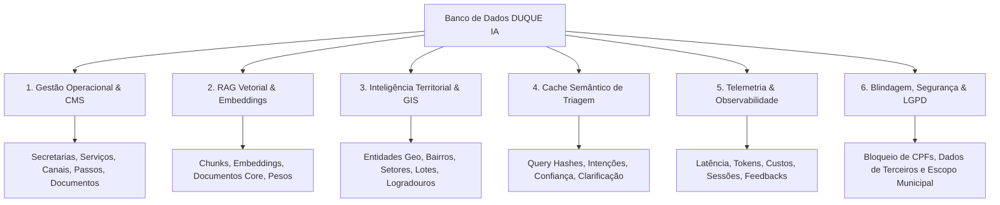

# Diagnóstico e Estrutura Completa do Banco de Dados — DUQUE IA

## 1. Visão Geral

Este documento apresenta o **diagnóstico real e empírico do banco de dados** do projeto **DUQUE IA (Sistema de Informações Municipais de Duque de Caxias)**, detalhando:
1. **Como o banco ESTÁ atualmente** (diagnóstico físico, arquivos, tabelas e contagem de dados populados).
2. **Tudo o que PRECISAMOS ter no banco** (requisitos funcionais, vetoriais, territoriais/GIS, telemetria, cache e blindagem LGPD).
3. **Plano de manutenção e recomendações de evolução**.

---

## 2. Como o Banco de Dados ESTÁ Atualmente (Estado Real)

A auditoria física realizada nos arquivos do projeto revelou que a base de dados está organizada de forma otimizada e modular no diretório `data/db/`:

```
data/db/
├── main.db       (Dados operacionais relacionais, Carta de Serviços, Canais e Ontologia)
├── vector.db     (Busca Semântica RAG, Chunks e Embeddings)
├── cache.db      (Cache de Triagem de Intenções do LangGraph Lite)
└── telemetry.db  (Histórico de Atendimentos, Mensagens, Logs RAG e Feedback do Munícipe)
```

### 📊 Contagem Real de Registros por Banco de Dados

#### 1. Banco Relacional (`data/db/main.db`) — **18 Tabelas**
Contém toda a Carta de Serviços oficial da Prefeitura de Duque de Caxias e a ontologia municipal:

| Tabela | Função | Quantidade de Registros |
| :--- | :--- | :---: |
| `services` | Cadastro oficial de serviços públicos municipais | **372** |
| `service_documents` | Documentos obrigatórios exigidos do munícipe | **1.981** |
| `service_steps` | Etapas / Passo a passo de execução dos serviços | **1.638** |
| `service_emails` | E-mails institucionais de atendimento | **333** |
| `service_phones` | Telefones de suporte dos serviços | **316** |
| `service_links` | Links/URLs de formulários e portais | **208** |
| `categories` | Categorias e taxonomias municipais | **18** |
| `secretarias` | Secretarias e órgãos municipais | **1** |
| `secretaria_unidades` | Unidades físicas descentralizadas (ex: postos do CRAS/UPAs) | **6** |
| `municipal_entities` | Ontologia municipal (sinônimos e aliases de bairros/órgãos) | **6** |
| `triage_cache` | Espelho de cache relacional | **1** |
| `schema_version` | Controle de versão de esquema | **1** |
| `service_priorities` | Regras de atendimento prioritário | **0** |
| `service_categories` | Tabela de relacionamento N:N | **0** |
| `users` | Usuários do painel de administração | **0** |
| `service_history` | Logs de auditoria e alteração cadastral | **0** |
| `schema_migrations` | Histórico de migrações | **0** |
| `sqlite_sequence` | Sequenciadores de ID do SQLite | **10** |

#### 2. Banco Vetorial (`data/db/vector.db`) — **7 Tabelas**
Contém os fragmentos (chunks) de texto indexados para busca semântica RAG:

| Tabela | Função | Quantidade de Registros |
| :--- | :--- | :---: |
| `duque_ia_chunks` | Chunks de documentos com vetores de embedding | **852** |
| `embedding_metadata` | Metadados do modelo de embeddings utilizado | **1** |
| `schema_version` | Versão do esquema vetorial | **1** |
| `core_documents` | Documentos-fonte originais indexados | **0** |
| `chunks_metadata` | Metadados adicionais de rastreabilidade | **0** |

#### 3. Cache de Triagem (`data/db/cache.db`) — **4 Tabelas**
Acelera a classificação de intenções do munícipe sem consumir tokens extras de LLM:

| Tabela | Função | Quantidade de Registros |
| :--- | :--- | :---: |
| `triage_cache` | Decisões de triagem semântica em cache (`query_hash`) | **282** |
| `schema_version` | Versão de esquema | **1** |

#### 4. Telemetria e Atendimento (`data/db/telemetry.db`) — **7 Tabelas**
Estrutura pronta para recepção de logs de atendimento em produção:

| Tabela | Função | Quantidade de Registros |
| :--- | :--- | :---: |
| `rag_queries` | Telemetria de queries RAG (latência, custo, tokens, fontes) | **0** |
| `chat_sessions` | Sessões ativas de conversação | **0** |
| `chat_messages` | Histórico completo de mensagens (turnos user/assistant) | **0** |
| `chat_feedback` | Avaliações do munícipe (upvote/downvote/comentários) | **0** |

---

## 3. Tudo o que PRECISAMOS Ter no Banco de Dados (Requisitos do Ecossistema)

Para atender às especificações do **DUQUE IA**, a arquitetura de banco de dados deve cobrir **6 módulos funcionais fundamentais**:



### Módulo 1: Gestão Operacional (CMS da Carta de Serviços)
* **Objetivo**: Garantir respostas precisas sobre prazos, custos, telefones, e-mails, endereços e documentos exigidos.
* **Campos Obrigatórios**:
  * Nome do serviço, secretaria responsável, descrição e quem pode solicitar.
  * Prazos de atendimento (`waiting_time`, `max_deadline`) e custos (`cost`).
  * Canais múltiplos de contato (`service_phones`, `service_emails`, `service_links`).
  * Fluxo sequencial de execução (`service_steps`) e documentos obrigatórios (`service_documents`).
  * Unidades descentralizadas (`secretaria_unidades` — ex: postos do CRAS, UPAs).
  * View Cognitiva `vw_ia_servicos`: consolidação pronta para consumo do pipeline RAG.

### Módulo 2: RAG Vetorial & Embeddings (Busca Semântica)
* **Objetivo**: Permitir busca semântica em textos longos de leis, decretos, editais e manuais públicos.
* **Estrutura Vetorial**:
  * Fragmentos de texto (`duque_ia_chunks`): `content`, `embedding` (vetor em JSON/Blob), `category`, `source`, `keywords`.
  * Metadados do Modelo (`embedding_metadata`): provedor, nome do modelo (ex: `text-embedding-3-small` / Ollama) e dimensão vetorial.
  * Rastreabilidade (`core_documents` e `chunks_metadata`): controle por hash SHA-256 para evitar re-indexação redundante.

### Módulo 3: Inteligência Territorial & GIS (Sistema de Informações Geográficas)
* **Objetivo**: Responder dúvidas com contexto de geolocalização e subdivisão administrativa municipal.
* **Entidades Geográficas**:
  * Estrutura de entidades: Município, Bairro, Setor, Quadra, Lote e Logradouro.
  * Suporte a dados GeoJSON (importação de `FeatureCollections`).
  * Tabela `municipal_entities`: ontologia de nomes oficiais, bairros de Duque de Caxias, siglas e sinônimos populares.

### Módulo 4: Cache Semântico de Triagem (Performance & Redução de Custos)
* **Objetivo**: Acelerar respostas e economizar recursos em perguntas frequentes.
* **Campos da Tabela `triage_cache`**:
  * `query_hash`: Hash MD5/SHA256 da pergunta normalizada.
  * `intent`: Intenção identificada pelo classificador (ex: `duque_servico`, `duque_informacao`, `fora_escopo`).
  * `confidence`: Nível de confiança da triagem.
  * `needs_clarification`: Flag para acionamento do **Agente Coletor** quando falta contexto na pergunta.

### Módulo 5: Telemetria, Histórico e Feedback (Observabilidade)
* **Objetivo**: Auditar a qualidade da IA, registrar custos e permitir melhoria contínua.
* **Tabelas de Telemetria**:
  * `rag_queries`: registra `query_text`, `sources_used`, `total_time_ms`, `llm_time_ms`, `tokens_used`, `cost_usd` e `confidence_score`.
  * `chat_sessions` e `chat_messages`: mantêm o histórico das sessões de conversa dos munícipes.
  * `chat_feedback`: registra avaliações (upvote/downvote e comentários) para re-treinamento de rotas.

### Módulo 6: Blindagem, Segurança e LGPD
* **Objetivo**: Garantir conformidade legal e privacidade.
* **Regras do Banco/Sistema**:
  * Bloqueio estrito de armazenamento ou retorno de dados pessoais sensíveis (CPFs, nomes de vizinhos, dados de terceiros).
  * Filtro de competência municipal (rejeição automática de perguntas sobre esferas federal/estadual).
  * Redirecionamento para a Ouvidoria Geral de Duque de Caxias (**(21) 2652-3835** / WhatsApp **(21) 99824-5903**) em casos de dúvida ou indisponibilidade.

---

## 4. Esquemas Físicos Declarativos (DDL)

O projeto possui a definição SQL modular em `database/`:

1. **Relacional Principal**: [schema_main.sql](file:///c:/Users/501379.PMDC/Desktop/PRODUCAO/database/schema_main.sql)
2. **Vetorial**: [schema_vector.sql](file:///c:/Users/501379.PMDC/Desktop/PRODUCAO/database/schema_vector.sql)
3. **Cache de Triagem**: [schema_cache.sql](file:///c:/Users/501379.PMDC/Desktop/PRODUCAO/database/schema_cache.sql)
4. **Telemetria**: [schema_telemetry.sql](file:///c:/Users/501379.PMDC/Desktop/PRODUCAO/database/schema_telemetry.sql)

E a documentação técnica consolidada em [docs/03-Banco/Dicionario.md](file:///c:/Users/501379.PMDC/Desktop/PRODUCAO/docs/03-Banco/Dicionario.md).

---

## 5. Diretrizes de Manutenção e Evolução

Conforme estabelecido nas regras do projeto:

> ⚠️ **Regra Fundamental de Preservação**: Uma vez que o banco de dados esteja criado e populado (como atualmente com 372 serviços e 852 chunks vetoriais), **NUNCA deletar ou recriar o banco por completo**. Quaisquer alterações ou novas cargas devem ser feitas de forma **incremental**.

### Próximos Passos Recomendados
1. **Manutenção Incremental**: Utilizar pipelines de atualização que apenas insiram novos chunks ou atualizem registros modificados (com base em `updated_at` ou hash SHA-256).
2. **Expansão GIS (Fase 6)**: Inserir a taxonomia e geometrias dos bairros de Duque de Caxias na tabela `municipal_entities` ou em módulo GIS dedicado.
3. **Conexão de Telemetria**: Garantir que as rotas da API em produção gravem os logs de conversa diretamente em `telemetry.db` (`chat_sessions` e `chat_messages`).
