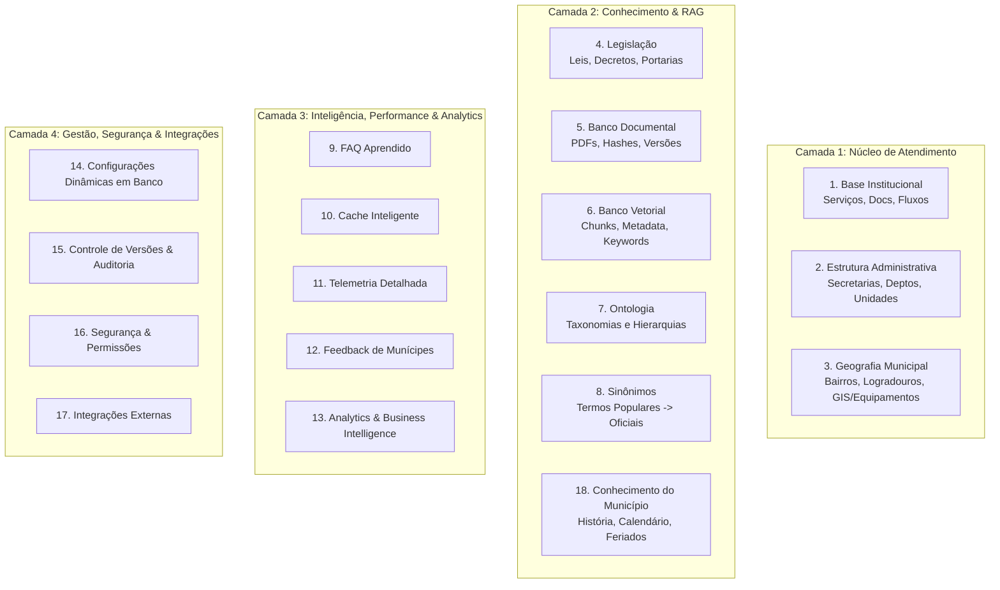

# Arquitetura da Base de Conhecimento Institucional — DUQUE IA

> **Especificação Técnica e Conceitual de Longo Prazo**  
> **Prefeitura Municipal de Duque de Caxias / RJ**  
> **Conceito:** Transição de "Banco de Carta de Serviços" para **Base de Conhecimento Institucional do Município (Municipal Knowledge Base)**

---

## 1. Visão Geral do Novo Paradigma

O **DUQUE IA** deixa de ser apenas um sistema de consulta à Carta de Serviços e evolui para a **Base de Conhecimento Institucional da Prefeitura Municipal de Duque de Caxias**. 

### 💡 Por que essa mudança é fundamental?
1. **Atendimento Universal**: O cidadão não pergunta apenas sobre como solicitar um serviço; ele questiona leis, secretários responsáveis, endereços de escolas, bairros, história da cidade, feriados e andamento de programas públicos.
2. **Rastreabilidade Factual e Jurídica**: Cada resposta fornecida pela IA passa a citar leis, decretos, portarias ou documentos oficiais com hashes e versões auditáveis.
3. **Resiliência e Longevidade**: O sistema torna-se capaz de crescer e incorporar novas secretarias, portais, integrações e dados municipais sem a necessidade de redesenhar a arquitetura de banco de dados.

---

## 2. A Estrutura em 18 Módulos de Conhecimento

A Base de Conhecimento Institucional é organizada em **18 módulos estratégicos divididos em camadas**, cobrindo todas as vertentes da administração pública municipal:



---

### 📂 CAMADA 1: NÚCLEO INSTITUCIONAL & TERRITORIAL

#### Módulo 1. Base Institucional (Serviços e Processos)
* **Objetivo**: Estruturar a Carta de Serviços e o fluxo completo de atendimento ao cidadão.
* **Componentes**:
  * **Serviços**: Nome, descrição, público-alvo, requisitos, prazos, custo, secretaria responsável, categoria, prioridades, base legal e situação (`published`/`draft`/`archived`).
  * **Documentos Exigidos**: Nome do documento, obrigatoriedade, via (original/cópia) e observações.
  * **Fluxo Sequencial**: Etapas numeradas (`step_number`), prazo estimado por etapa e área responsável.

#### Módulo 2. Estrutura Administrativa
* **Objetivo**: Permitir que a IA compreenda a hierarquia e competências internas da Prefeitura.
* **Componentes**:
  * **Secretarias**: Nome oficial, sigla (ex: SMS, SME, SMOSP), titular/secretário, e-mails, telefones e competências institucionais.
  * **Departamentos & Subsecretarias**: Subdivisões internas e atribuições.
  * **Unidades Físicas**: CRAS, CREAS, UPAs, Postos de Saúde, Escolas e Centros Atendimento com endereço, bairro, CEP, horário de funcionamento, telefones e coordenadas de geolocalização.

#### Módulo 3. Geografia Municipal (SIG / GIS)
* **Objetivo**: Dar inteligência espacial ao sistema para responder sobre localidades e equipamentos de Duque de Caxias.
* **Componentes**:
  * **Bairros**: Nome oficial, sinônimos/apelidos locais, região administrativa, distrito e código interno.
  * **Logradouros**: Ruas, avenidas, alamedas, CEPs e bairros correspondentes.
  * **Equipamentos Públicos**: Escolas, hospitais, praças, postos e feiras mapeados com Latitude e Longitude (GPS).

---

### 📚 CAMADA 2: ACERVO DOCUMENTAL, LEGISLAÇÃO & ONTOLOGIA

#### Módulo 4. Legislação Municipal
* **Objetivo**: Permitir respostas jurídicas precisas ancoradas na legislação municipal.
* **Componentes**:
  * **Atos Normativos**: Leis Orgânicas, Leis Complementares, Decretos, Portarias, Resoluções e Instruções Normativas.
  * **Atributos**: Título, número, data de publicação, órgão emissor, situação (em vigor/revogada), hash de integridade, versão e texto integral formatado.

#### Módulo 5. Banco Documental (Gestão de Documentos Oficiais)
* **Objetivo**: Controlar o ciclo de vida de cada PDF/documento importado no pipeline.
* **Atributos**: `id`, `titulo`, `categoria`, `fonte`, `url_original`, `sha256_hash`, `versao`, `publicado_em`, `atualizado_em`.

#### Módulo 6. Banco Vetorial Estendido (RAG Multidimensional)
* **Objetivo**: Enriquecer a busca semântica com metadados profundos.
* **Atributos por Chunk**: ID do documento, página, seção, categoria, secretaria responsável, palavras-chave extraídas, vetor de embedding, hash, versão e idioma.

#### Módulo 7. Ontologia e Hierarquia Conceitual
* **Objetivo**: Mapear conexões conceituais para que a IA entenda a relação entre o termo informal do munícipe e a estrutura pública.
* **Exemplos de Grafo Conceitual**:
  ```
  IPTU ──► Imposto ──► Tributo Municipal ──► Secretaria Municipal de Fazenda
  Luz Apagada ──► Iluminação Pública ──► Serviço Urbano ──► Secretaria de Obras
  Poda de Árvore ──► Manejo de Vegetação ──► Serviço Ambiental ──► Secretaria de Meio Ambiente
  ```

#### Módulo 8. Tabela de Sinônimos e Mapeamento Vocabular
* **Objetivo**: Traduzir a linguagem popular do munícipe diretamente para os termos oficiais.
* **Mapeamento de Sinônimos**:
  * `"poste queimado"` / `"luz apagada"` ──► **Iluminação Pública**
  * `"buraco na rua"` / `"asfalto retado"` ──► **Tapa-Buraco / Pavimentação**
  * `"mato alto"` / `"capinação"` ──► **Limpeza Urbana e Raspação**

#### Módulo 18. Conhecimento do Município e Memória Institucional
* **Objetivo**: Responder dúvidas sobre a cidade sem depender da internet ou fontes externas.
* **Componentes**: História de Duque de Caxias, distritos (1º, 2º, 3º e 4º distritos), dados demográficos, datas comemorativas, calendário de feriados municipais, programas de governo e projetos estratégicos em andamento.

---

### 🚀 CAMADA 3: DESEMPENHO, TELEMETRIA & INTELIGÊNCIA APRENDIDA

#### Módulo 9. FAQ Aprendido (Auto-Enriquecimento)
* **Objetivo**: Transformar perguntas reais dos cidadãos em conhecimento consolidado.
* **Estrutura**: Pergunta frequente, resposta validada, serviço associado, contador de utilização, data do último uso e índice de confiança.

#### Módulo 10. Cache Inteligente de Triagem
* **Objetivo**: Garantir respostas em milissegundos para perguntas repetidas.
* **Estrutura**: `query`, `query_normalizada`, `query_hash`, `intent`, `confidence`, `ttl`, `hits_count`, `last_used_at`.

#### Módulo 11. Telemetria Detalhada de Observabilidade
* **Objetivo**: Medir a latência exata de cada camada do pipeline.
* **Métricas por Pergunta**: ID da sessão, tempo de triagem, tempo da busca SQL, tempo da busca vetorial, tempo do reranker, tempo do LLM, total de tokens, custo financeiro em USD, fontes utilizadas e nota de confiança.

#### Módulo 12. Feedback do Munícipe
* **Objetivo**: Coletar a percepção do usuário para ajuste do modelo.
* **Atributos**: Mensagem associada, tipo (`upvote`/`downvote`), motivo da insatisfação, comentário do cidadão e resposta gerada.

#### Módulo 13. Analytics & Inteligência de Negócio (BI Cidadão)
* **Objetivo**: Fornecer dashboards estratégicos para a gestão municipal.
* **Insights Gerados**: Serviços mais demandados por bairro, horários de pico de dúvidas, taxa de acerto do cache, perguntas sem resposta (lacunas de informação) e custo financeiro diário/mensal.

---

### ⚙️ CAMADA 4: GESTÃO, CONFIGURAÇÕES, SEGURANÇA & INTEGRAÇÕES

#### Módulo 14. Configurações Dinâmicas em Banco (Sem Redeploy)
* **Objetivo**: Permitir que administradores ajustem parâmetros de IA via painel web sem reiniciar a aplicação ou alterar arquivos `.env`.
* **Parâmetros no Banco**: `modelo_llm`, `modelo_embedding`, `temperature`, `top_k`, `top_n`, `similarity_threshold`, `reranker_weights`, `feature_flags`.

#### Módulo 15. Controle de Versões e Auditoria Cadastral
* **Objetivo**: Registrar todo o histórico de alterações na Carta de Serviços e regulamentos.
* **Rastreabilidade**: ID do registro, versão, usuário autor da mudança, campo alterado, valor antigo, valor novo, data e justificativa.

#### Módulo 16. Segurança, Permissões e Acesso
* **Objetivo**: Gerenciar acessos de gestores municipais e chaves de API.
* **Estrutura**: Usuários, perfis de acesso (`admin`, `editor`, `viewer`), logs de autenticação, chaves de API para integrações e gerenciador de sessões.

#### Módulo 17. Integrações Externas
* **Objetivo**: Mapear e sincronizar o DUQUE IA com os sistemas oficiais da Prefeitura.
* **Sistemas Integrados**:
  * **Colab**: Plataforma de registro de solicitações e zeladoria urbana.
  * **Ouvidoria Geral**: Sistema de manifestações e denúncias.
  * **Portal da Transparência & Diário Oficial**: Sincronização automática de publicações de leis e atos.
  * **e-SIC**: Sistema de Informações ao Cidadão.

---

## 3. Mapeamento de Transição: Como o Sistema Atual se Encaixa

O banco de dados atual do DUQUE IA já possui a fundação ideal para esta arquitetura, distribuído na pasta `data/db/`:

```
Estrutura Atual                        Módulos da Base de Conhecimento
┌─────────────────────────┐            ┌─────────────────────────────────────────┐
│ data/db/main.db         │ ─────────► │ Módulo 1 (Serviços, Passos, Documentos) │
│ (372 Serviços)          │            │ Módulo 2 (Secretarias, Unidades)        │
│                         │            │ Módulo 8 (Ontologia/Entities)           │
└─────────────────────────┘            └─────────────────────────────────────────┘
┌─────────────────────────┐            ┌─────────────────────────────────────────┐
│ data/db/vector.db       │ ─────────► │ Módulo 5 (Banco Documental)             │
│ (852 Chunks Vetoriais)  │            │ Módulo 6 (Banco Vetorial Estendido)     │
└─────────────────────────┘            └─────────────────────────────────────────┘
┌─────────────────────────┐            ┌─────────────────────────────────────────┐
│ data/db/cache.db        │ ─────────► │ Módulo 10 (Cache Inteligente)           │
│ (282 Itens de Cache)    │            │ Módulo 9 (FAQ Aprendido)                │
└─────────────────────────┘            └─────────────────────────────────────────┘
┌─────────────────────────┐            ┌─────────────────────────────────────────┐
│ data/db/telemetry.db    │ ─────────► │ Módulo 11 (Telemetria Detalhada)        │
│ (Logs e Sessões)        │            │ Módulo 12 (Feedback do Munícipe)        │
└─────────────────────────┘            └─────────────────────────────────────────┘
```

---

## 4. Roteiro de Expansão Incremental (Plano Sem Perda de Dados)

Em respeito rigoroso às regras do projeto de **não deletar nem recriar o banco existente**, a transição ocorre em 4 ondas incrementais:

1. **Onda 1 (Atual - Concluída)**: Estabilização dos Módulos 1, 2, 5, 6, 10 e 11 com 372 serviços e 852 chunks vetoriais em execução.
2. **Onda 2 (Expansão Vocabular e Territorial)**: População dos Módulos 3 (Geografia/GIS), 7 (Ontologia) e 8 (Sinônimos) adicionando tabelas de suporte sem afetar as tabelas ativas.
3. **Onda 3 (Acervo Legislativo e Conhecimento)**: Criação das tabelas do Módulo 4 (Legislação Municipal) e Módulo 18 (Conhecimento do Município), permitindo a carga de leis e decretos.
4. **Onda 4 (Gestão Dinâmica e Analytics)**: Implementação do Módulo 14 (Configurações Dinâmicas em Banco) e Módulo 13 (Analytics BI) para controle via painel administrativo sem necessidade de novos deploys.
