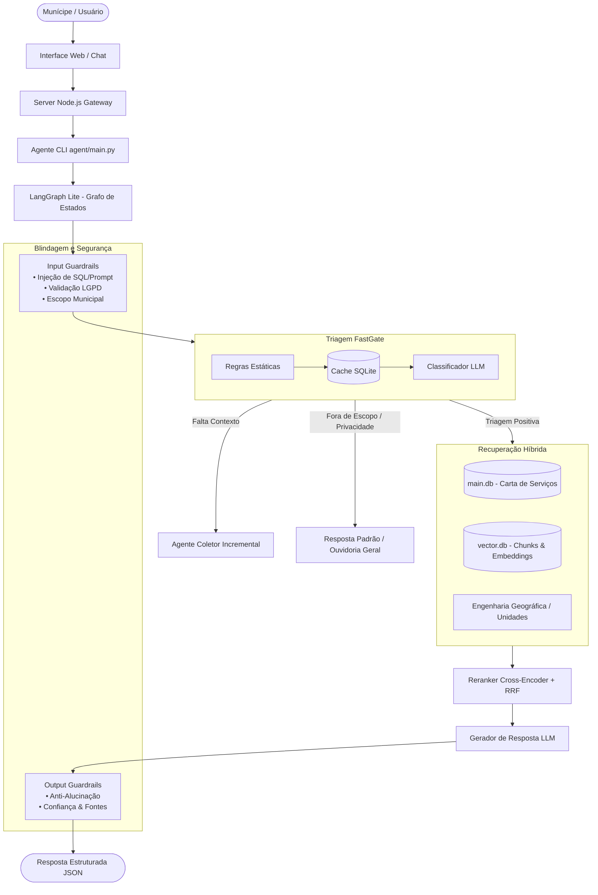

# DUQUE IA — Sistema de Informações Municipais com Inteligência Artificial

> **Documento Explicativo do Sistema**  
> **Prefeitura Municipal de Duque de Caxias / RJ**  
> **Projeto:** Framework RAG & Agente de Atendimento Inteligente ao Munícipe

---

## 1. O que é o DUQUE IA?

O **DUQUE IA** é a plataforma oficial de **Inteligência Artificial e Atendimento ao Cidadão** da Prefeitura de Duque de Caxias. O sistema foi desenvolvido para transformar o relacionamento entre a administração pública municipal e os munícipes, oferecendo respostas imediatas, precisas, contextualizadas e juridicamente seguras sobre todos os serviços públicos da cidade.

Em vez de exigir que o munícipe navegue por centenas de páginas de portais ou leia decretos complexos, o DUQUE IA atua como um **assistente virtual cidadão**, capaz de tirar dúvidas sobre:
* **Carta de Serviços Municipais**: prazos, custos, telefones, e-mails, links de formulários e documentos obrigatórios para cada solicitação.
* **Unidades Físicas de Atendimento**: endereços e horários do CRAS, Postos de Saúde, UPAs e secretarias.
* **Orientações de Processos e Manifestações**: esclarecimento de dúvidas e direcionamento para registro formal na plataforma **Colab** ou na **Ouvidoria Geral**.

---

## 2. Como o Sistema Funciona (Visão Geral da Arquitetura)

O DUQUE IA combina técnicas avançadas de **RAG (Retrieval-Augmented Generation)**, **Orquestração de Estados por Grafo (LangGraph Lite)**, **Triagem Semântica Otimizada** e **Blindagem de Segurança (Guardrails)**.



---

## 3. Principais Componentes e Módulos do Sistema

### 3.1. Orquestrador por Grafo de Estados (`LangGraph Lite`)
O fluxo de decisão do agente é guiado por um grafo de estados determinístico escrito em Python puro. Cada mensagem enviada pelo munícipe passa por nós bem definidos:
1. **Security / Guardrails Node**: Avalia se a pergunta é segura e se pertence ao âmbito municipal.
2. **Triagem Node (FastGate)**: Identifica a intenção (`duque_servico`, `duque_informacao`, `fora_escopo`, etc.).
3. **Agente Coletor Node**: Se a dúvida for ambígua ou incompleta, faz **perguntas incrementais (uma por vez)** para coletar dados essenciais antes de acionar a busca ou direcionar para o aplicativo Colab.
4. **Retrieval Node**: Executa a busca pelos dados mais relevantes.
5. **Reranking Node**: Reorganiza e ranqueia os dados mais precisos.
6. **Generation Node**: Constrói a resposta final factual e amigável.

### 3.2. Mecanismo de Busca Híbrida RAG (Relacional + Vetorial)
O sistema não depende apenas de busca vetorial comum. Ele utiliza uma abordagem **multiconta de alta precisão**:
* **Busca Relacional (FTS / SQL)**: Consulta direta nas tabelas da Carta de Serviços (`main.db`), obtendo dados exatos como telefones, e-mails, prazos e documentos.
* **Busca Vetorial Semântica**: Consulta no banco de embeddings (`vector.db`) para interpretar perguntas feitas com sinônimos ou linguagem informal.
* **Fusão RRF (Reciprocal Rank Fusion) + Cross-Encoder**: Combina os resultados relacionais e vetoriais, aplicando um algoritmo de re-ranqueamento para garantir que os chunks de maior relevância fiquem no topo.

### 3.3. Triagem de Desempenho (FastGate)
Para garantir respostas em milissegundos e economizar chamadas a modelos de linguagem, a triagem funciona em 3 camadas:
1. **Filtro Estático**: Identifica rapidamente saudações ou comandos simples.
2. **Cache Semântico local (`triage_cache`)**: Se a mesma dúvida já foi classificada anteriormente, utiliza a decisão armazenada no banco `cache.db`.
3. **Classificador LLM**: Utilizado apenas para perguntas inéditas e complexas.

---

## 4. Diretrizes de Atendimento, Blindagem e LGPD (POP)

O DUQUE IA adota um protocolo estrito de operação (POP) para garantir segurança jurídica e respeito ao munícipe:

### 🛡️ 1. Proteção de Dados e Privacidade (LGPD)
* **Bloqueio de Dados Sensíveis**: A IA **nunca** retorna CPFs, nomes de reclamantes ou andamento de protocolos de terceiros (vizinhos).
* Ao detectar tentativas de busca por dados de terceiros, o sistema bloqueia a consulta e emite uma mensagem padrão de recusa por privacidade.

### 🏛️ 2. Competência Estritamente Municipal
* O sistema identifica e rejeita perguntas sobre assuntos fora da alçada da Prefeitura de Duque de Caxias (ex: metrô, previdência federal, rodovias federais).
* Nesses casos, emite uma mensagem de não-competência indicando os órgãos corretos.

### ☎️ 3. Redirecionamento e Fallback Oficial para a Ouvidoria
Em situações onde a informação não seja encontrada ou haja falha na busca, o sistema substitui erros genéricos pelo direcionamento imediato para a **Ouvidoria Geral de Duque de Caxias**:
* **Telefone**: (21) 2652-3835
* **WhatsApp**: (21) 99824-5903

### ✍️ 4. Boas Práticas de Comunicação
* **Sem Saudações Redundantes**: Respostas objetivas sem rodeios ("Olá! Que bom ter você aqui...").
* **Destaques Factuais**: Endereços, prazos, contatos e documentos obrigatórios sempre formatados em **negrito**.
* **Orientação para Registro de Demandas**: Instrução clara para o munícipe reunir dados essenciais (CPF, endereço completo do fato, pontos de referência e fotos) antes de abrir solicitações na plataforma **Colab**.

---

## 5. Estrutura de Bancos de Dados e Dados do Sistema

O sistema opera com uma arquitetura de micro-bancos SQLite em `data/db/`:

| Banco de Dados | Conteúdo e Função | Registros Atuais |
| :--- | :--- | :---: |
| **`main.db`** | Dados operacionais da Carta de Serviços (Serviços, Passos, Documentos, Telefones, E-mails, Links, Unidades e Ontologia) | **372 Serviços / 1.981 Docs / 1.638 Passos** |
| **`vector.db`** | Fragmentos de textos oficiais (chunks) e vetores de embeddings para busca semântica RAG | **852 Chunks Vetoriais** |
| **`cache.db`** | Cache de decisões semânticas de triagem para otimização de latência e custo | **282 Entradas em Cache** |
| **`telemetry.db`** | Logs analíticos de chamadas RAG, histórico de sessões/mensagens e feedback dos munícipes | **Pronto para Atendimento** |

---

## 6. Formato Padrão de Resposta do Sistema

Toda resposta gerada pelo pipeline do DUQUE IA é entregue em um objeto JSON estruturado contendo a resposta ao cidadão, as fontes utilizadas e o grau de confiança:

```json
{
  "answer": "Para solicitar a **Iluminação Pública**, você pode ligar para o telefone **(21) 2652-3835** ou registrar a solicitação no aplicativo **Colab**. É necessário informar o **endereço completo do poste** e um **ponto de referência**.",
  "sources": [
    "Carta de Serviços - Secretaria Municipal de Obras e Serviços Públicos"
  ],
  "confidence": 0.95
}
```

---

## 7. Resumo dos Benefícios do DUQUE IA

* **Atendimento 24/7**: Disponibilidade ininterrupta para a população de Duque de Caxias.
* **Transparência e Precisão**: Respostas baseadas 100% em fontes oficiais da prefeitura.
* **Agilidade no Serviço Público**: Redução de filas e tempo de espera em postos presenciais.
* **Economia de Recursos**: Respostas em cache e triagem otimizada minimizam custos operacionais.
* **Conformidade Legal**: Blindagem completa contra vazamento de dados (LGPD) e respostas fora de competência.
