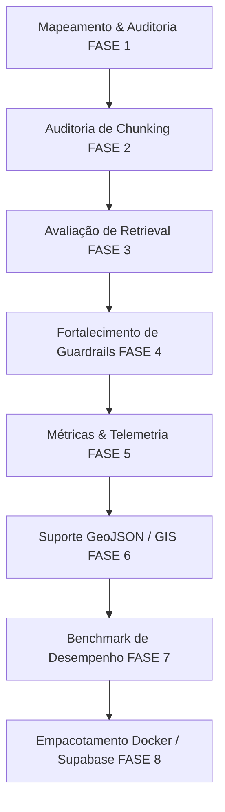

# Análise Arquitetural Completa e Mapeamento do Framework RAG — DUQUE IA

> **Auditoria Arquitetural — FASE 1: MAPEAMENTO COMPLETO**  
> **Data:** 2026-07-29 | **Sistema:** DUQUE IA (Sistema de Informações Municipais — Duque de Caxias / RJ)  
> **Autor:** Arquiteto Sênior de IA (Antigravity AI Agent)

---

## 1. Visão Geral e Diagrama Textual da Arquitetura

O **DUQUE IA** é um framework RAG (Retrieval-Augmented Generation) de nível empresarial, projetado para o atendimento ao munícipe da Prefeitura de Duque de Caxias / RJ. O sistema adota uma arquitetura descentralizada de micro-bancos de dados (SQLite `main.db`, `vector.db`, `cache.db`, `telemetry.db`), orquestração por Grafo de Estados (LangGraph Lite em Python puro), triagem semântica em múltiplos níveis, busca híbrida (relacional + vetorial RRF) e blindagem rigorosa de segurança (Input, Output e Privacy Guardrails).

```text
                               ┌───────────────────────────────────┐
                               │     Cliente Web / Frontend        │
                               └─────────────────┬─────────────────┘
                                                 │ HTTP POST /api/chat
                                                 ▼
                               ┌───────────────────────────────────┐
                               │       server.js (Node.js)         │  Gateway HTTP & Gestão de Sessões
                               └─────────────────┬─────────────────┘
                                                 │ UTF-8 Pipe (stdin/stdout)
                                                 ▼
                               ┌───────────────────────────────────┐
                               │       agent/main.py (CLI)         │  Entry Point Python
                               └─────────────────┬─────────────────┘
                                                 │
                                                 ▼
                               ┌───────────────────────────────────┐
                               │       agent/agent.py              │  Orquestrador DuqueIAAgent
                               └─────────────────┬─────────────────┘
                                                 │
                                                 ▼
                               ┌───────────────────────────────────┐
                               │       agent/graph.py              │  LangGraph Lite (Grafo de Estados)
                               └─────────────────┬─────────────────┘
                                                 │
            ┌────────────────────────────────────┼────────────────────────────────────┐
            │                                    │                                    │
            ▼                                    ▼                                    ▼
 ┌─────────────────────┐              ┌─────────────────────┐              ┌─────────────────────┐
 │  Input Guardrails   │              │   Triagem FastGate  │              │   Query Rewriter    │
 │ (agent/guardrails)  │              │   (agent/triage)    │              │  (agent/handlers)   │
 │ • Prompt Injection  │              │ • Regras estáticas  │              │ • Histórico         │
 │ • SQL Injection     │              │ • Cache SQLite      │              │ • Resolução de      │
 │ • LGPD / Privacidade│              │ • LLM Classifier    │              │   referências       │
 │ • Competência Munic.│              └──────────┬──────────┘              └──────────┬──────────┘
 └──────────┬──────────┘                         │                                    │
            │                                    └──────────────────┬─────────────────┘
            └────────────────────────────────────┐                  │
                                                 ▼                  ▼
                                       ┌───────────────────────────────────┐
                                       │   Roteamento de Handlers          │
                                       │   (agent/handlers.py)             │
                                       └─────────────────┬─────────────────┘
                                                         │
       ┌───────────────────────┬─────────────────────────┼─────────────────────────┬───────────────────────┐
       ▼                       ▼                         ▼                         ▼                       ▼
┌──────────────┐       ┌──────────────┐          ┌──────────────┐          ┌──────────────┐        ┌──────────────┐
│  Security    │       │ Conversation │          │  Collector   │          │  Ambiguity   │        │  RAG Handler │
│  Handler     │       │   Handler    │          │   Handler    │          │   Handler    │        │  (Retrieval) │
└──────┬───────┘       └──────┬───────┘          └──────┬───────┘          └──────┬───────┘        └──────┬───────┘
       │                      │                         │                         │                       │
       └──────────────────────┴─────────────────────────┼─────────────────────────┴───────────────────────┘
                                                        │
                                                        ▼
                                       ┌───────────────────────────────────┐
                                       │     agent/retrieval.py            │  Retriever Híbrido Multiconta
                                       └────────────────┬──────────────────┘
                                                        │
                ┌───────────────────────────────────────┼───────────────────────────────────────┐
                ▼                                       ▼                                       ▼
     ┌─────────────────────┐                 ┌─────────────────────┐                 ┌─────────────────────┐
     │   SQLite Main       │                 │   SQLite Vector     │                 │  Geographic Engine  │
     │ (vw_ia_servicos,    │                 │ (duque_ia_chunks,   │                 │ (unidades_cras,     │
     │  carta_servicos)    │                 │  gemini-emb 768d)   │                 │  bairros / postos)  │
     └──────────┬──────────┘                 └──────────┬──────────┘                 └──────────┬──────────┘
                │                                       │                                       │
                └───────────────────────────────────────┼───────────────────────────────────────┘
                                                        │ Candidatos Recuperados
                                                        ▼
                                       ┌───────────────────────────────────┐
                                       │       agent/reranker.py           │  Cross-Encoder Reranking
                                       │ (GeminiCrossEncoder + RRF Fusion) │  (60% Cross + 40% Hybrid)
                                       └────────────────┬──────────────────┘
                                                        │ Top Chunks Ranqueados
                                                        ▼
                                       ┌───────────────────────────────────┐
                                       │     agent/handlers.py             │  Gerador de Respostas LLM
                                       │ (Prompt Builder + Gemini API)     │
                                       └────────────────┬──────────────────┘
                                                        │ Resposta Candidata
                                                        ▼
                                       ┌───────────────────────────────────┐
                                       │       Output Guardrail            │  Verificação Anti-Alucinação
                                       │      (agent/guardrails.py)        │  & Sanitização LGPD
                                       └────────────────┬──────────────────┘
                                                        │ Resposta Final JSON
                                                        ▼
                                       ┌───────────────────────────────────┐
                                       │   database/telemetry.db           │  Telemetria & Métricas
                                       └───────────────────────────────────┘
```

---

## 2. Fluxos Principais do Sistema

### 2.1 Fluxo de Ingestão de Dados (`ingestion/parser/`)
- **Fontes Suportadas**: PDFs Oficiais, Carta de Serviços (XLSX/CSV), Documentos Web (Scraped Markdown), Ofícios Digitalizados (OCR) e Tabelas Estruturadas de Assuntos/Unidades.
- **Módulos de Ingestão**:
  - `parse_carta_servico.py`: Processa planilhas estruturadas da Carta de Serviços da Prefeitura.
  - `parse_oficios_ocr.py`: Trata anexos e ofícios scanned com OCR Tesseract/PyMuPDF.
  - `parse_pdfs.py`: Extração e chunking recursivo hierárquico de decretos, leis e normativas municipais.
  - `parse_web.py`: Extração limpa do portal oficial da Prefeitura de Duque de Caxias.
  - `populate_structured_services.py`: Registra serviços diretamente nas visões relacionais (`vw_ia_servicos`).
  - `inject_ouvidoria_chunk.py`: Injeta contatos oficiais e fluxos de atendimento da Ouvidoria Geral.

### 2.2 Fluxo de Gerador de Embeddings (`ingestion/embed/`)
- **Módulo**: `ingestion/embed/core.py` e `ingestion/embed/main.py`.
- **Modelo de Embedding**: `gemini-embedding-2` (768 dimensões com normalização L2).
- **Armazenamento**: Tabela `duque_ia_chunks` e índices vetoriais em `database/vector.db` (`sqlite-vec`).
- **Estratégia de Chunking**: Chunking contextualizado com prefixo hierárquico (`[Documento: X | Seção: Y]`).

### 2.3 Fluxo de Retrieval e Reranking (`agent/retrieval.py` e `agent/reranker.py`)
1. **Reescrita e Expansão de Query**: Expandida em até 3 sub-queries focadas via `agent/planner.py` (método LORS).
2. **Busca Híbrida em Paralelo**:
   - *Busca Vetorial*: Cosine similarity em `vector.db` (top-K chunks).
   - *Busca Relacional FTS*: Match exato/BM25 nas tabelas relacionais de serviços e secretarias (`main.db`).
   - *Busca de Entidades Geográficas*: Mapeamento de unidades físicas (CRAS, Postos de Saúde, Bairros) via `agent/entity_resolver.py`.
3. **Fusão RRF (Reciprocal Rank Fusion)**: Combina rankings de BM25 e busca vetorial.
4. **Reranking Cross-Encoder**: Avaliação do alinhamento semântico profundo com peso `0.60 * CrossEncoderScore + 0.40 * HybridScore`.

### 2.4 Fluxo de Triagem e Tomada de Decisão (`agent/triage.py` e `agent/graph.py`)
- **FastGate (0ms)**: Expressões regulares e regras determinísticas interceptam saudações, tentativas de SQL/Prompt Injection e consultas LGPD bloqueadas.
- **Cache de Triagem**: Consultas recorrentes são respondidas com latência zero via `database/cache.db`.
- **Classificador LLM**: Classifica intenção (`RAG_GERAL`, `COLETOR_INFO`, `AMBIGUIDADE`, `FORA_COMPETENCIA`, `LGPD_PRIVACIDADE`, `PROGRAMACAO`, `AGRADECIMENTO`).

---

## 3. Matriz de Dependências Entre Módulos

| Módulo Orquestrador | Dependências Diretas | Função e Papel |
| :--- | :--- | :--- |
| `agent/agent.py` | `agent/triage.py`, `agent/retrieval.py`, `agent/handlers.py`, `agent/guardrails.py`, `utils/gemini_client.py` | Orquestrador principal da classe `DuqueIAAgent`. |
| `agent/graph.py` | `agent/triage.py`, `agent/handlers.py`, `agent/guardrails.py` | Grafo de Estados LangGraph Lite para roteamento resiliente. |
| `agent/triage.py` | `utils/gemini_client.py`, `config/settings.py`, `database/cache.db` | Triagem de intenções em 3 níveis com fallback Gracioso. |
| `agent/retrieval.py` | `utils/db_client.py`, `agent/entity_resolver.py`, `config/settings.py` | Busca híbrida multiconta e resolução de entidades físicas. |
| `agent/handlers.py` | `utils/gemini_client.py`, `agent/context_builder.py`, `agent/fallback.py` | Execução de nós de resposta (Collector, Ambiguity, RAG). |
| `agent/guardrails.py` | `config/settings.py` | Filtros de segurança de entrada/saída (SQLi, Prompt Injection, LGPD). |

---

## 4. Auditoria de Segurança, LGPD e Blindagem POP

### 4.1 Input Guardrails
- **Prompt Injection**: Intercepta tentativas de desvio ("ignore instruções anteriores", "você agora é...").
- **SQL Injection**: Detecta comandos SQL perigosos (`DROP TABLE`, `UNION SELECT`, `DELETE FROM`).
- **LGPD / Privacidade de Terceiros**: Impede buscas por CPFs de terceiros, nomes de munícipes ou andamento de processos de vizinhos. Resposta de bloqueio padronizada sem expor dados.
- **Competência Municipal**: Filtra perguntas sobre esferas Federal/Estadual (Metrô, INSS, Rodovias Federais, etc.) e emite recusa por falta de competência da Prefeitura de Duque de Caxias.

### 4.2 Fallback e Redirecionamento Direto para Ouvidoria Geral
Quando as buscas no RAG não atingem o limiar de confiança exigido (`score < threshold`), a resposta substitui mensagens genéricas de erro pelo direcionamento direto:
- **Telefone Ouvidoria Geral**: `(21) 2652-3835`
- **WhatsApp Ouvidoria Geral**: `(21) 99824-5903`
- **Plataforma Colab**: Instrução para preenchimento de dados essenciais (CPF, endereço completo com ponto de referência e fotos).

### 4.3 Agente Coletor (Triagem de Esclarecimento Contextual)
Quando `needs_clarification: true`, o sistema aciona o modo **Agente Coletor**:
- Avalia o histórico recente de conversas para preservar o contexto dos turnos anteriores.
- Realiza perguntas amigáveis e **estritamente incrementais (uma solicitação por vez)** para evitar sobrecarregar o cidadão.
- Direciona o munícipe a abrir o chamado na plataforma **Colab** vinculando-o à Secretaria adequada.

---

## 5. Mapeamento de Gargalos e Oportunidades de Melhoria

1. **Latência no Classificador LLM de Triagem**:
   - *Gargalo*: Quando a consulta não cai no FastGate, há uma chamada remota ao LLM para triagem antes do retrieval.
   - *Melhoria*: Expandir o cache determinístico local e usar modelos ultra-rápidos (`gemini-3.1-flash-lite`) com resposta estruturada via JSON Schema.
2. **Integração SIG / GIS Territorial (Duque 2.0)**:
   - *Oportunidade*: Implementar o Chunking por Entidade Geográfica (1 entidade territorial = 1 chunk com GeoJSON da feição) para responder consultas por bairro, distrito, setor e lote.
3. **Consistência de Thresholds Dinâmicos**:
   - *Gargalo*: Ajuste dinâmico de score limiar dependendo da categoria de serviços.
   - *Melhoria*: Padronização do Cross-Encoder com trava máxima `min(score, 1.0)` para evitar inflação de relevância.

---

## 6. Recomendação Arquitetural e Roadmap para PRODUÇÃO



---
*Documento gerado e validado em conformidade com as diretrizes do projeto DUQUE IA.*
