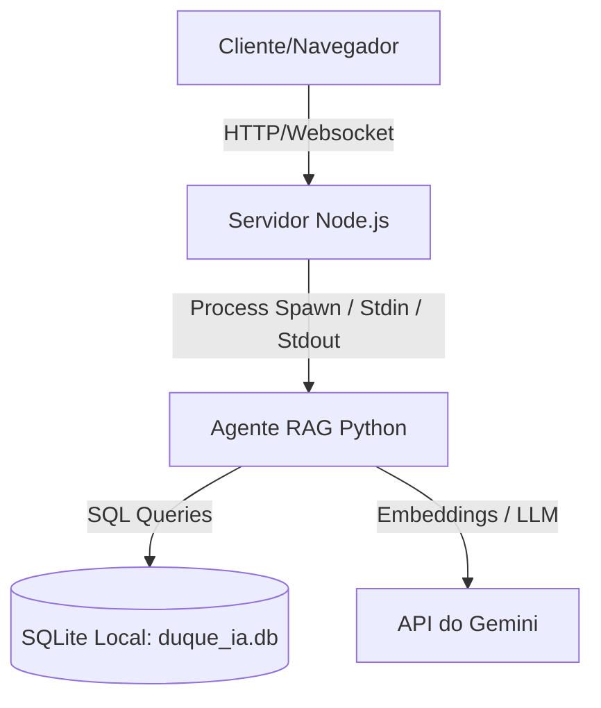

# Arquitetura do Sistema — Duque IA

O Duque IA foi desenvolvido utilizando uma arquitetura híbrida de alto desempenho que combina um servidor HTTP Node.js com um agente RAG em Python.

## Componentes Principais
1. **Frontend**: Interface web minimalista e responsiva construída em HTML5 e CSS Vanilla, com suporte a micro-animações.
2. **Servidor Node.js (`server.js`)**: Gerencia o tráfego HTTP, serve os arquivos estáticos, mantém o ciclo de vida das sessões dos usuários e gerencia a comunicação bidirecional com o agente Python via subprocessos (spawn).
3. **Agente Python (`agent/`)**:
   - `main.py`: Entrada do script interativo (mantém loop de leitura/resposta em stdin/stdout).
   - `agent.py`: Núcleo de processamento que gerencia o fluxo de triagem, guardrails e roteamento.
   - `triage.py`: Classifica a intenção do munícipe.
   - `retrieval.py`: Executa buscas híbridas no banco local SQLite e Cross-Encoder.
   - `guardrails.py`: Executa verificações de segurança pré e pós LLM.

---
[Avançar: Fluxo](Fluxo.md) | [Voltar: Visão Geral](Visao-Geral.md)
