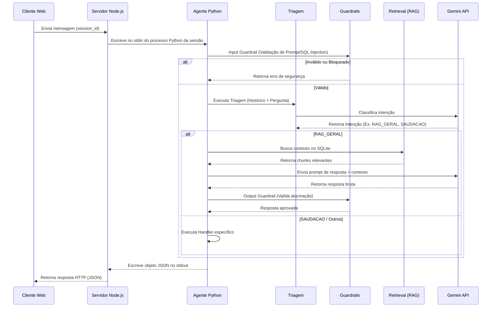

# Fluxo de Processamento de Dados — Duque IA

O diagrama abaixo detalha o caminho percorrido por uma mensagem enviada pelo munícipe até o retorno da resposta estruturada.

---
[Avançar: Instalação](../02-Instalacao/Instalacao.md) | [Voltar: Arquitetura](Arquitetura.md)
