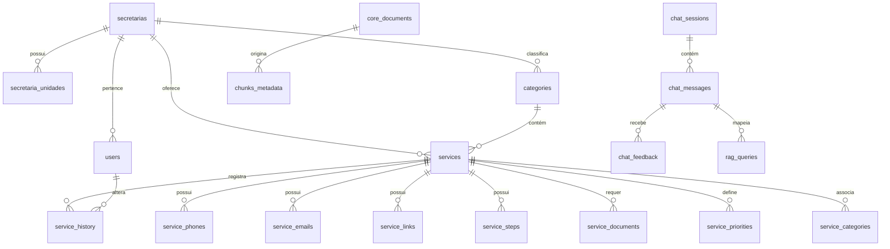

# Diagrama Entidade-Relacionamento (DER) — Duque IA

## Relacionamentos Principais
- **1:N (Secretarias para Serviços)**: Uma secretaria gerencia diversos serviços públicos.
- **1:N (Serviços para Telefones/E-mails/Passos)**: Cada serviço municipal detalhado na Carta de Serviços possui múltiplos meios de contato e etapas de solicitação.
- **1:N (Sessões para Mensagens)**: Cada sessão de chat possui o histórico de diálogos do munícipe.

---
[Avançar: Dicionário](Dicionario.md) | [Voltar: Banco](Banco.md)
