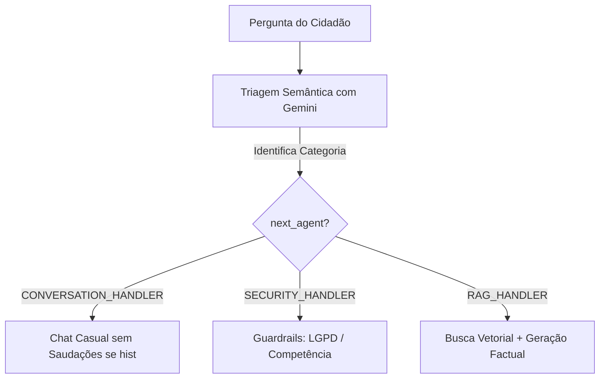

# Fluxos de Decisão de IA — Duque IA

O fluxo de IA do Duque IA opera em duas camadas principais:

```mermaid
graph TD
    Query[Pergunta do Cidadão] --> Triage[Triagem Semântica com Gemini]
    Triage -->|Identifica Categoria| Routing{next_agent?}
    Routing -->|CONVERSATION_HANDLER| Casual[Chat Casual sem Saudações se hist]
    Routing -->|SECURITY_HANDLER| Blocked[Guardrails: LGPD / Competência]
    Routing -->|RAG_HANDLER| RAG[Busca Vetorial + Geração Factual]
```

---
[Avançar: Agentes](Agentes.md) | [Voltar: Prompts](Prompts.md)
