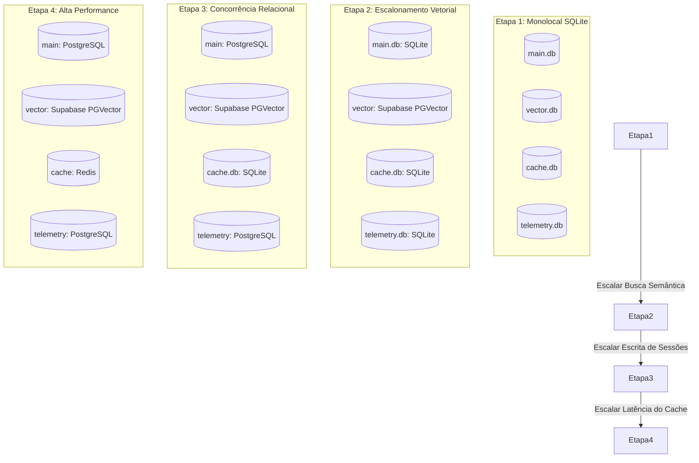

# Relatório de Auditoria — Organização dos Bancos de Dados

> **Status:** Concluído | **Objetivo:** Avaliar a segregação lógica e física das bases de dados do DUQUE IA, apresentar os riscos técnicos do modelo monolítico atual e propor uma arquitetura distribuída para produção.

---

## 1. Cenário Atual: O Monólito SQLite

Atualmente, o projeto utiliza um único arquivo SQLite centralizado: **`data/db/duque_ia.db`**. 

Dentro desse único arquivo, coexistem dados com naturezas e ciclos de vida completamente distintos:

```text
data/db/duque_ia.db (Monolítico)
├── [Relacional] Secretarias, Serviços, Telefones, Unidades Físicas (CRAS)
├── [Vetorial] Chunks de textos e listas JSON de floats (Embeddings)
├── [Cache] Respostas semânticas rápidas da triagem (triage_cache)
└── [Logs & Telemetria] Sessões de chats, mensagens e logs de queries (rag_queries)
```

### Riscos Técnicos da Abordagem Monolítica em Produção:
1.  **Trava de Escrita (Write Locks):** O SQLite opera com bloqueio a nível de arquivo (file-locking) durante operações de escrita. Se logs (`rag_queries`) ou turnos de conversas de múltiplos cidadãos estiverem sendo escritos concorrentemente, o arquivo inteiro é travado, bloqueando leituras de busca RAG ou acertos de cache da triagem.
2.  **Crescimento Indefinido (Database Bloat):** Chunks vetoriais e logs de sessões de chat crescem exponencialmente em relação aos dados de cadastro das secretarias (que mudam raramente). Isso torna backups, migrações e restaurações do banco de dados desnecessariamente lentos e pesados.
3.  **Ciclos de Invalidação Conflitantes:** O cache da triagem precisa de políticas de limpeza rápidas (TTL), enquanto os logs precisam de retenção de longa duração para auditoria, e os dados estruturados de secretarias precisam de persistência perpétua.

---

## 2. Proposta de Evolução Arquitetural em Camadas

Para mitigar a complexidade prematura, propomos uma transição pragmática em **quatro etapas evolutivas**, mantendo a simplicidade operacional do SQLite no início e escalando a tecnologia apenas sob demanda real:



### Detalhes das Etapas e Tecnologias:

*   **Etapa 1 (Atual Recomendada):** Divisão lógica e física do arquivo único em quatro bancos de dados SQLite locais sob `data/db/` (`main.db`, `vector.db`, `cache.db` e `telemetry.db`). Custo zero de infraestrutura e isolamento total de travas (write-locks).
*   **Etapa 2:** Migração exclusiva do banco vetorial (`vector.db`) para PostgreSQL com extensão **PGVector** (ou Supabase) à medida que o volume de chunks e a complexidade de buscas aproximadas crescerem.
*   **Etapa 3:** Migração do banco relacional (`main.db`) e do banco analítico (`telemetry.db`) para servidores PostgreSQL apenas quando houver requisitos de alta concorrência de escrita simultânea (ex: múltiplos agentes logados editando serviços ou milhares de chats paralelos).
*   **Etapa 4:** Substituição do banco de cache (`cache.db`) por um servidor **Redis** para suporte a cache distribuído em rede apenas se a latência na resolução de intenções se tornar um gargalo sob extrema carga.

---

## 3. Abstração de Acesso aos Dados: Padrão Repositório (Repository Pattern)

Para permitir a substituição transparente dos drivers de banco de dados (SQLite, PostgreSQL, Redis) sem alterar as lógicas de negócio do RAG, propomos a criação de uma camada de abstração (**Storage Layer**):

```text
Código do Agente / Handlers
           │
           ▼
     Storage Layer (Abstração)
     ├── MainRepository       ──> Métodos para ler secretarias e serviços
     ├── VectorRepository     ──> Métodos para buscar chunks semânticos
     ├── CacheRepository      ──> Métodos para salvar/ler triage cache
     └── TelemetryRepository  ──> Métodos para logar queries e sessões
           │
           ▼ (Injeção do Driver Específico)
    [SQLite Driver / PostgreSQL Driver / Redis Client]
```

---

## 4. Configuração Centralizada e Backups

### Configurações de Conexão (.env)
A definição das URIs de conexão deve ser centralizada globalmente, evitando caminhos de arquivos espalhados:
```bash
# Configurações do Banco de Dados
DATABASE_MAIN=sqlite:///data/db/main.db
DATABASE_VECTOR=sqlite:///data/db/vector.db
DATABASE_CACHE=sqlite:///data/db/cache.db
DATABASE_TELEMETRY=sqlite:///data/db/telemetry.db
```

### Estratégia Diferenciada de Backup e Políticas de Retenção
Com a segregação física, cada banco de dados assume uma política de backup otimizada, reduzindo custos de armazenamento:

| Banco | Frequência de Backup | Destino do Backup | Política de Retenção | Justificativa |
| :--- | :--- | :--- | :--- | :--- |
| **Main (Relacional)** | Diária (Full) | Cold Storage (AWS S3) | 365 dias | Dados mestre de secretarias e Carta de Serviços. Críticos e de baixo volume. |
| **Vector (Semântico)** | Mensal ou sob demanda | Não aplicável | Não aplicável | Não exige backup contínuo; pode ser totalmente reconstruído rodando o pipeline de ingestão (`embed/main.py`). |
| **Cache (Triagem)** | Não aplicável | Não aplicável | Não aplicável | Dados efêmeros e voláteis. Sem necessidade de backup ou restauração. |
| **Telemetry (Logs/Sessões)** | Semanal (Incremental) | Cold Storage | 90 dias com rotação periódica | Volume alto de escrita. Rotação periódica impede inchaço do banco em produção. |
