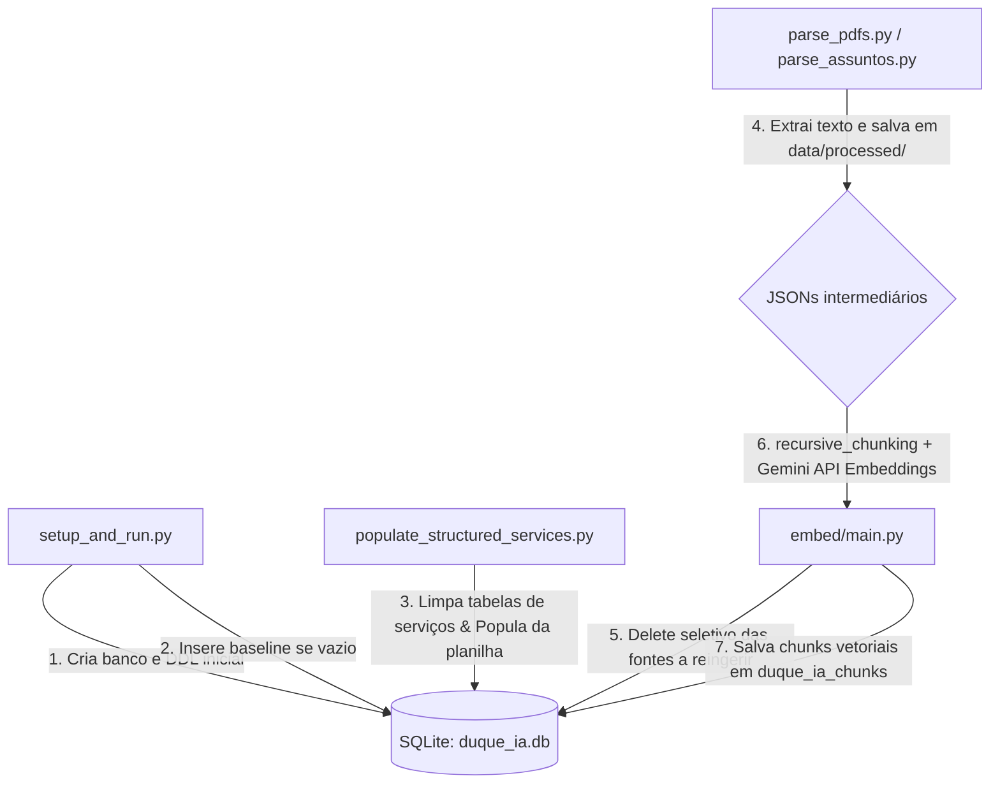

# Relatório de Auditoria — População do Banco de Dados

> **Status:** Concluído | **Objetivo:** Auditar os fluxos de ingestão, população estruturada/vetorial e analisar redundâncias de scripts e códigos duplicados no projeto DUQUE IA.

---

## 1. Ciclo de População do Banco

Abaixo está o mapeamento detalhado de como os dados entram, são atualizados e limpos no banco SQLite `data/db/duque_ia.db`:



### Detalhamento das Responsabilidades:
1.  **Quem Cria:**
    *   `setup_and_run.py` (via `setup_database()`) cria o banco de dados e as tabelas relacionais primárias no startup do servidor.
    *   `scripts/setup/setup_supabase.py` (executado manualmente por desenvolvedores) cria a mesma estrutura de tabelas caso seja necessário testar a integração com o Supabase.
2.  **Quem Insere:**
    *   `setup_and_run.py`: Insere a base de secretarias e unidades do CRAS se as respectivas tabelas estiverem sem registros.
    *   `ingestion/parser/populate_structured_services.py`: Lê a planilha Excel de Carta de Serviços e insere os registros estruturados de serviços, telefones, e-mails, links, passos de execução e documentação exigida.
    *   `ingestion/embed/main.py`: Lê os arquivos JSON intermediários gerados, divide-os em pedaços (chunks), gera os vetores de embedding usando a API do Gemini e insere-os na tabela `duque_ia_chunks`.
    *   `ingestion/parser/inject_ouvidoria_chunk.py`: Insere chunks adicionais relativos a canais de ouvidoria.
3.  **Quem Atualiza / Sincroniza:**
    *   O pipeline RAG é **incremental e preservativo**. 
    *   O script `ingestion/embed/main.py` implementa um **DELETE SELETIVO** antes da indexação:
        ```python
        conn.cursor().execute("DELETE FROM duque_ia_chunks WHERE source IN (...);", sources_to_reingest)
        ```
        Isso garante que apenas os chunks das fontes modificadas ou reingeridas sob `data/processed/` sejam excluídos e atualizados, preservando chunks históricos ou dados manuais.
4.  **Quem Limpa e Recria:**
    *   `populate_structured_services.py` executa comandos de limpeza completa das tabelas de serviços e secretarias antes de processar a planilha para evitar dados duplicados.
    *   Nenhum script deleta o banco `.db` fisicamente de forma destrutiva por padrão durante a operação do servidor.

---

## 2. Diagnóstico de Redundâncias e Scripts Abandonados

Abaixo está o mapeamento técnico de scripts sob `/scripts` e `/ingestion` que possuem sobreposições ou obsolescência:

| Script / Caminho | Função | Status de Auditoria | Risco / Recomendação |
| :--- | :--- | :--- | :--- |
| `scripts/setup/setup_supabase.py` | Configuração de Tabelas no Supabase | **Duplicidade de DDL** | Contém exatamente os mesmos SQLs de `CREATE TABLE` do `setup_and_run.py`. **Recomendação:** Centralizar as DDLs em um arquivo `.sql` único na raiz para reuso e evitar divergências de schemas. |
| `ingestion/parser/parse_csv.py` | Leitura genérica de CSVs | **Legado / Demonstrativo** | Contém um protótipo de parsing que foi superado por parsers dedicados. Pode ser arquivado em `/archive/scripts/`. |
| `ingestion/parser/parse_excel.py` | Leitura genérica de Excel | **Legado / Demonstrativo** | Protótipo genérico sem uso ativo. O parser oficial é o `populate_structured_services.py`. |

---

## 3. Recomendações para Produção

*   **Centralização de DDLs:** Extrair a criação de tabelas do Python e unificar em um script DDL consolidado (ex: `data/db/schema.sql`).
*   **Tratamento de Transações no Setup:** Garantir que inserções iniciais em `setup_and_run.py` rodem dentro de um bloco de transação segura para evitar estados parciais do banco em caso de interrupção abrupta do startup.
